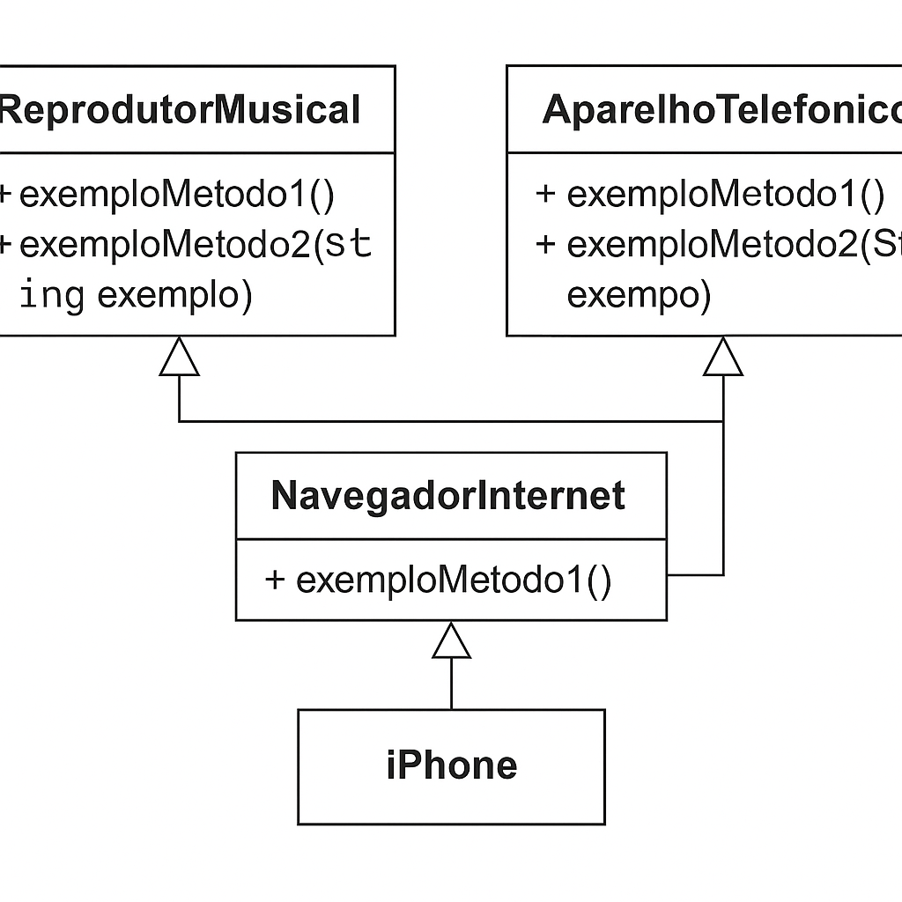

# Diagrama de Classes - iPhone

Este projeto demonstra a implementação de um modelo orientado a objetos baseado em um diagrama UML utilizando Java.

## 📦 Estrutura

- `ReprodutorMusical.java`: Interface para funcionalidades de música.
- `AparelhoTelefonico.java`: Interface para funcionalidades de telefone.
- `NavegadorInternet.java`: Interface para funcionalidades de navegação na internet.
- `iPhone.java`: Classe que implementa as três interfaces acima.

## 📐 Diagrama UML



## ✅ Exemplo de Código

```java
// Exemplo de uso
public class Main {
    public static void main(String[] args) {
        iPhone meuIphone = new iPhone();
        meuIphone.exemploMetodo1();
        meuIphone.exemploMetodo2("Minha Música");

        meuIphone.exemploMetodo1Telefone();
        meuIphone.exemploMetodo2Telefone("123456789");

        meuIphone.exemploMetodo1Navegador();
        meuIphone.exemploMetodo2Navegador("www.exemplo.com");
    }
}
```
